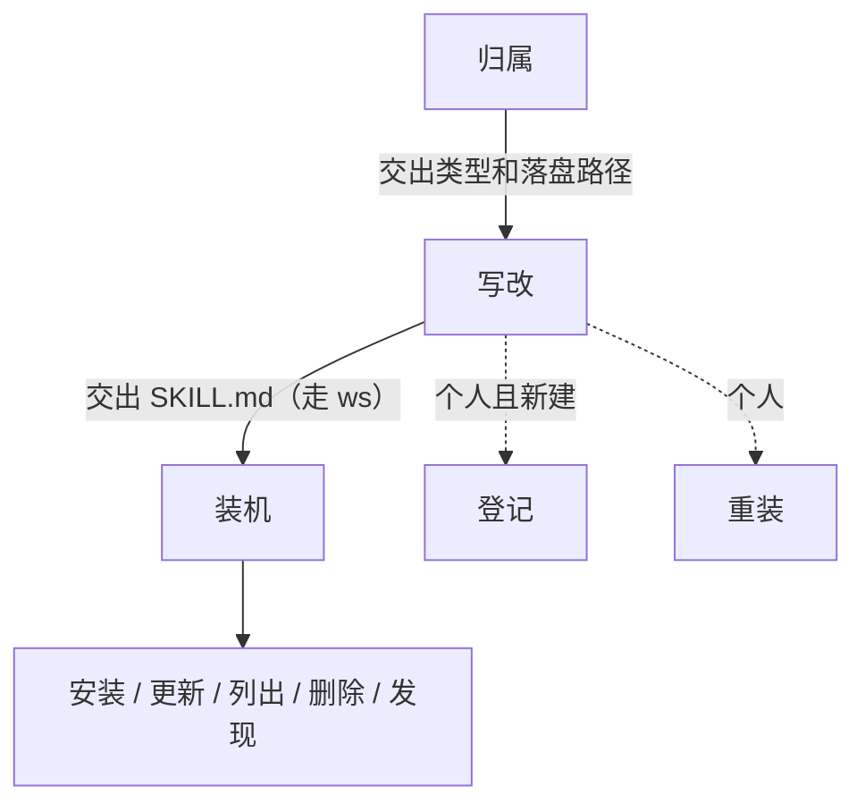

# workflow

```mermaid
flowchart TD
  belong[归属] -->|交出类型和落盘路径| edit[写改]
  edit -->|"交出 SKILL.md（走 ws）"| install[装机]
  edit -.->|个人且新建| register[登记]
  edit -.->|个人| reinstall[重装]
  install --> ops["安装 / 更新 / 列出 / 删除 / 发现"]
```
