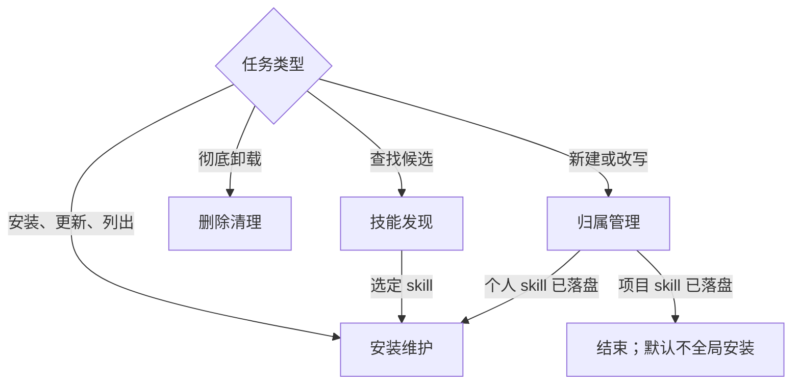

# workflow

```mermaid
flowchart TD
  A{任务类型} -->|新建或改写| B[归属管理]
  A -->|安装、更新、列出| C[安装维护]
  A -->|彻底卸载| D[删除清理]
  A -->|查找候选| E[技能发现]
  E -->|选定 skill| C
  B -->|个人 skill 已落盘| C
  B -->|项目 skill 已落盘| F[结束；默认不全局安装]
```
