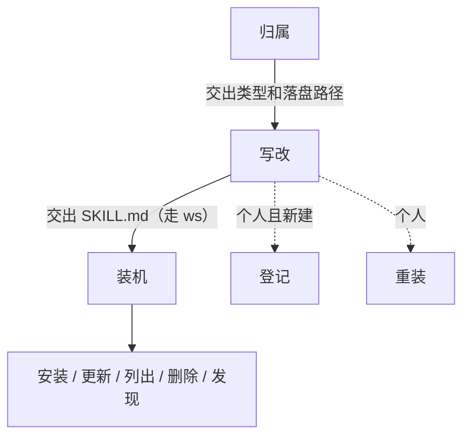

触发 ms。第一下：判定这份 skill 是项目还是个人，再动文件。



安装 / 更新 / 列表：Skills CLI（`npx skills` / `skills`）。全局删除：本 skill 的 `scripts/remove-global-skill.sh`（勿只跑不带 `-a '*'` 的 `skills remove`，会留残留）。正文怎么写、材料怎么摆，都走 write-skill（`ws`，含「表达规定」）。

## 1. 归属

先判再动。这一条单独成组：没定项目还是个人，后面的落盘、登记、重装都会走错仓。它不写正文，只定路径和是否重装。

### 1.1 判定落盘归属

写 / 改之前先定归属，再动文件：

| 类型 | 何时 | 落盘 | 登记 / 重装 |
|---|---|---|---|
| **项目 skill** | 跟着某个产品仓库走（如 `yodo-browser-skill` 的主 skill） | 该仓库 `skills/<skill-name>/SKILL.md` | **不进** `my-skills`；不改个人仓的 `plugin.json`；默认**不全局安装**（用户明确要求再装） |
| **个人 skill** | 跨项目、装进 agent 全局用 | `yanggggjie/my-skills` → `skills/<skill-name>/SKILL.md` | 新建则登记 `plugin.json`；写完立刻重装 |

可观察结果：已判定类型；后续只走对应分支。拿不准就问用户一句「这是项目 skill 还是个人 skill？」。

## 2. 写改

起草、落盘、登记、重装是同一条写 skill 链。正文和表达规定走 write-skill，本 skill 只定归属和装机。落盘不把三份 md 带进 skill 目录；登记和重装只对个人 skill。

### 2.1 起草改写

正文怎么写：先读 write-skill（触发词 `ws`，含小改 / 大改和「表达规定」）。

1. 对着 write-skill 的 `templates/` 把三份 md 写到目标仓 `skills/temp-skill/<skill-name>/`（小改不写）
2. 再写一份 `SKILL.md`

文案默认**简体中文**（含 `description`）；`name` 英文 kebab-case。仅用户明确要求其它语言时切换。

可观察结果：大改时 `skills/temp-skill/<skill-name>/` 里有三份 md；`skills/<skill-name>/SKILL.md` 已写成；结构与展开符合 `ws`。

### 2.2 落盘

落到「判定落盘归属」那张表对应的路径：目录 `skills/<skill-name>/`，文件名 `SKILL.md`。

- 三份 md 留在 `skills/temp-skill/<skill-name>/`
- 不要放进 skill 目录
- 不随 skill 安装

可观察结果：文件在判定路径；项目 skill 未误写入 `my-skills`；skill 目录里没有这三份 md。

### 2.3 登记

仅**个人 skill** 且新建：在 `.claude-plugin/plugin.json` 的 `skills` 中追加 `"./skills/<skill-name>"`；没有该文件则按下方参考新建。项目 skill 跳过。

可观察结果：个人 skill 时 `plugin.json` 含该路径；项目 skill 未改个人仓 `plugin.json`。

### 2.4 重装

仅**个人 skill**（见「安装」，通常本地路径 + `-s <skill-name>`）。项目 skill 默认停在「已落盘」。

可观察结果：个人 skill → `npx skills ls -g` 可见且 `~/.agents/skills/<name>` 已是本次内容；项目 skill → 未擅自全局安装。

`commit` / `push`（skill 正文 / `plugin.json`）仅在用户明确要求时做。未要求则停在归属分支的完成态（个人：已落盘 + 已重装；项目：已落盘）。

## 3. 装机

安装、更新、列出、删除、发现共用 Skills CLI 和同一套全局目录。不写正文，只改本机已装的 skill。

### 3.1 安装

始终：`-g`、symlink（勿传 `--copy`）、`-a '*'`（Skills CLI 支持的全部 agent）。

```bash
npx skills add <owner/repo> -g -y -a '*'
npx skills add <owner/repo> -g -y -a '*' -s <skill-name>
npx skills add <skills仓库本地路径> -g -y -a '*'
npx skills add <skills仓库本地路径> -g -y -a '*' -s <skill-name>
```

可观察结果：`npx skills ls -g` 可见；内容在 `~/.agents/skills/<name>`（canonical）；各 agent 目录多为指向该目录的 symlink。

### 3.2 更新

```bash
npx skills update -g              # 全部全局
npx skills update <skill-name> -g # 单个
```

可观察结果：退出码 0；内容与上游一致（或已是最新）。

### 3.3 列出与删除

列出：

```bash
npx skills ls -g
```

全局删除（可多个；对 `ls` 仍登记的每个 agent 卸干净，并清 `~/.agents/skills/<name>` 与指向它的 symlink）：

```bash
# 路径：本 skill 目录下；已全局安装时亦可用 ~/.agents/skills/manage-skills/scripts/...
scripts/remove-global-skill.sh <skill-name> [<skill-name>...]
```

可观察结果：`npx skills ls -g` 无该名；`~/.agents/skills/<name>` 不存在。

自检：`scripts/remove-global-skill.sh --self-check`（退出码 0）。

### 3.4 发现

```bash
npx skills find <query>
```

找到后按「安装」安装。更完整的发现流程可用 `find-skills`；安装命令不变。

## 参考

### 布局（个人仓与带 plugin 的技能仓）

```
<repo>/
  .claude-plugin/plugin.json   # 个人仓需要；纯项目仓可无
  skills/
    temp-skill/                # 与 skill 同级；梳理产物，不进 payload
      <skill-name>/
        use-case.md
        capability.md
        workflow.md
    <skill-name>/
      SKILL.md
      …可选附属文件
```

项目仓常见：只有 `skills/<name>/`，**没有** `.claude-plugin/plugin.json`，也无需为了写 skill 去建它。

### plugin.json 示例（个人仓）

```json
{
  "name": "my-skills",
  "version": "1.0.0",
  "description": "个人 agent skills。",
  "skills": [
    "./skills/gh-repos",
    "./skills/manage-skills"
  ]
}
```
