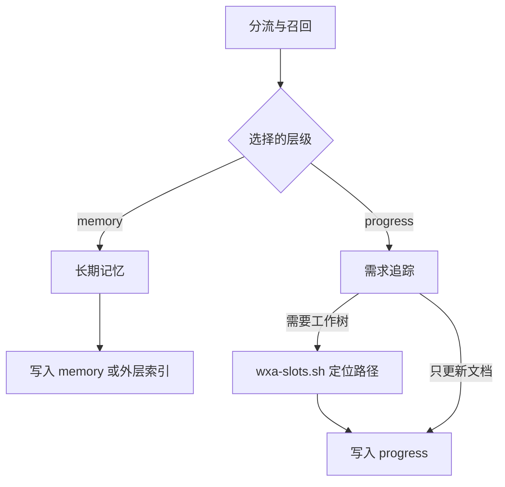

# workflow

```mermaid
flowchart TD
  A[分流与召回] --> B{选择的层级}
  B -->|memory| C[长期记忆]
  B -->|progress| D[需求追踪]
  D -->|需要工作树| E[wxa-slots.sh 定位路径]
  D -->|只更新文档| F[写入 progress]
  E --> F
  C --> G[写入 memory 或外层索引]
```
