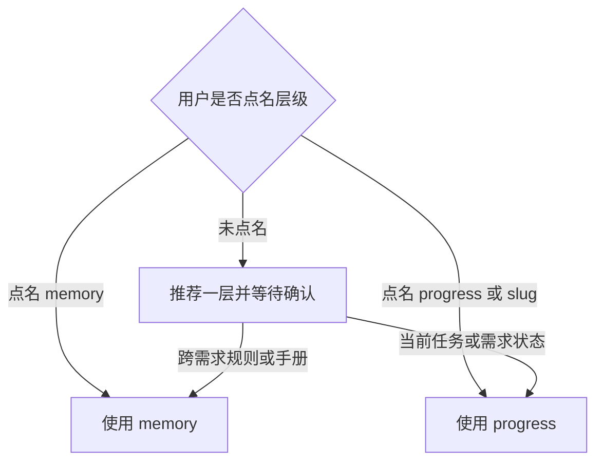

# 存储模型

`my-memory` 管理 `/Users/youshiyitian/Code/wxa/` 下两类内容：

| 层级 | 路径 | 保存内容 |
|---|---|---|
| `memory` | `/Users/youshiyitian/Code/wxa/memory/` | 跨需求仍成立的规则、手册与细则 |
| `progress` | `/Users/youshiyitian/Code/wxa/progress/<slug>/` | 单个需求的目标、git 分支、现状与日志 |

外层 `/Users/youshiyitian/Code/wxa/AGENTS.md` 只保存短硬规则和 `memory/` 索引。

**需求身份**
`progress/<slug>` 与一个 git 分支绑定。`slug` 使用简短英文 kebab-case，例如 `user-review`。

**检出槽位**
`wxa1` 至 `wxa4` 只是工作树槽位，不是需求身份。不得把当前槽、槽内绝对路径或 git 分支与槽位的对应关系写入 `memory/`、`progress/` 或外层 `AGENTS.md`。

# 选择层级

写入前必须明确选择 `memory` 或 `progress`。



未点名时只给出一句推荐和理由，等待用户确认或改口；确认前不写文件。

# 读取与召回

读取本轮需要的 `memory` 或 `progress` 文件。不要为了“可能有用”而扫描无关内容。

只要本轮实际读取过相关文件，回复靠前必须出现一行召回日志：

```text
memory-recall: memory:memory/日志查询.md, progress:progress/user-review/PROGRESS.md
```

每个 id 相对 `/Users/youshiyitian/Code/wxa/`，并使用 `memory:` 或 `progress:` 前缀。没有读取则不输出该行。

# 写入 memory

`memory` 只保存跨需求仍成立的知识。

1. 短硬规则与入口索引写入 `/Users/youshiyitian/Code/wxa/AGENTS.md`。
2. 详细规则和手册写入 `memory/<文件>.md`。
3. 已有中文文件名保持不变；新文件名使用英文 kebab-case。
4. 新建细则文件时，确保外层索引能够发现它。
5. 同一事实只保留一处权威，不在入口和细则中重复维护。
6. 不把单个需求的状态、日志或待办写入 `memory`。
7. 不修改 `wxa1` 至 `wxa4` 的薄文件，除非任务明确是在调整本树路径。

# 写入 progress

每个需求独占 `/Users/youshiyitian/Code/wxa/progress/<slug>/`。

1. 确定或新建 `slug`。
2. 读取已有 `PROGRESS.md`；不存在时按模板创建。
3. 在“路径与分支”中记录仓库名、git 分支和必要的仓内路径。
4. 更新目标、现状、未决与日志，使其反映本轮真实状态。
5. 详情放到同目录附属 Markdown，`PROGRESS.md` 作为入口，不与附属文件重复维护同一事实。
6. 不写入 `memory/`，不记录槽位或槽内绝对路径。

```markdown
# <slug>

## 目标

## 路径与分支

- 仓库：
- git 分支：

## 现状

## 未决

## 日志
```

# 定位工作路径

需要读取代码、修改代码或对工作树执行命令时，根据该需求绑定的 git 分支运行：

```bash
/Users/youshiyitian/Code/wxa/memory/wxa-slots.sh <git分支>
```

工作路径只取**本次 stdout**。忽略 progress、memory 或既往对话中出现过的槽位信息；本轮实际采用的路径必须出现在本次脚本输出中。

# 汇总累计代码变动

用户要求汇总整个需求迭代的累计变动时：

1. 从 `progress/<slug>/PROGRESS.md` 确定需求绑定的 git 分支与仓库。
2. 运行 `wxa-slots.sh <git分支>`，取得本轮工作路径。
3. 根据当前仓库和目标分支确定比较基线。
4. 使用 `git log --no-merges`、`git diff` 等命令，只检查该分支直接提交引入的变化。
5. 排除 merge commit 和来自其他分支的非直接提交。

最终汇总必须说明采用的分支、基线和范围，且不得混入其它需求的改动。

# 完成标准

- [ ] 写入前已经明确选择 `memory` 或 `progress`。
- [ ] 长期规则与需求进度没有混写。
- [ ] `progress/<slug>` 与 git 分支绑定，不与槽位绑定。
- [ ] 工作路径来自本轮 `wxa-slots.sh` 的 stdout。
- [ ] 同一事实只有一处权威。
- [ ] 实际读取文件时已输出准确的 `memory-recall` 行。
