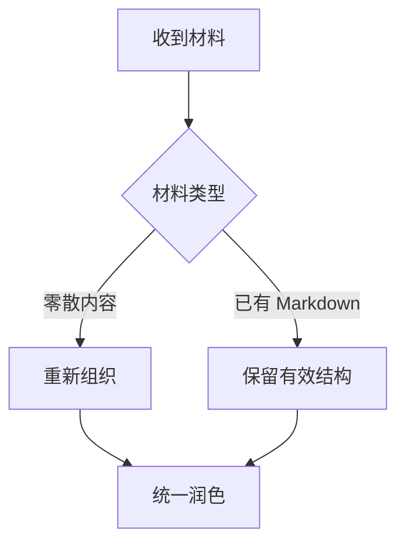

# 1. 目标

触发 `pmd` 或 `pretty-md` 后，把用户给出的材料整理成一份结构清楚、视觉舒展、能够快速扫读的 Markdown。

**漂亮**
不是堆叠语法，也不是把每句话都包装起来；而是让内容之间的关系一眼可见，让读者不必从大段文字中寻找层次。

只处理表达方式，不擅自改变事实、观点和含义。命令、路径、字段名、代码及用户要求保留的原话，必须保持字面内容不变。

# 2. 工作方式

先理解内容，再选择结构，最后统一润色。不要拿到材料便逐句套 Markdown 语法。

1. 识别材料的主题、层级和目的。
2. 把材料切成各自表达一个意思的内容块。
3. 判断每块内容是章节、并列、顺序、对照、流程、解释、代码、待办、原话，还是需要强调的信息。
4. 从十种表达形式中选择最合适的一种或几种组合。
5. 调整标题、间距、措辞和版面，让全文风格一致。
6. 依据检查清单复核后，交付完整 Markdown。

若用户只问“这段适合怎么表达”，说明建议采用的形式和理由即可；若用户要求整理、改写或美化，则直接交付整理后的正文。

# 3. 十种表达形式

每一种形式只解决它擅长的问题。优先使用最简单、最准确的结构；形式可以组合，但不要为了显得丰富而硬凑。

| 内容关系 | 表达形式 | 适合表达 |
|---|---|---|
| 层级 | 标题 | 文档骨架、章节边界 |
| 独立语义 | 段落 | 一个完整意思、必要说明 |
| 并列或顺序 | 列表 | 要点、选项、步骤 |
| 可追踪事项 | 任务 | 待办、完成状态、验收项 |
| 对照或映射 | 表格 | 字段、差异、归属、路径 |
| 分支或汇合 | 图 | 非线性流程、关系、结构 |
| 名词及解释 | 词条 | 术语、角色、触发词、概念 |
| 必须保留的原文 | 引用 | 原话、外部约定、摘录 |
| 字面内容 | 代码 | 命令、路径、字段、程序片段 |
| 局部视觉重点 | 粗体 | 关键词、结论、风险 |

## 3.1 标题

标题负责建立骨架。默认只使用 `#` 和 `##` 两级；材料确实复杂、两级无法准确表达时，才增加更深层级。

```markdown
# 1. 安装

## 1.1 环境要求

## 1.2 安装步骤
```

标题应简短、同级并列、命名方式一致。不要把一句普通说明写成标题，也不要让标题后没有实际内容。

## 3.2 段落

一个段落只表达一个中心意思。主题变化时换段；需要停顿、转折或补充时，也应给读者留出呼吸空间。

段落以清楚为先。能够用两三句说清楚，就不要扩成长篇散文；内容本质上是并列、对照或步骤时，应改用对应结构。

## 3.3 列表

没有先后关系的内容使用无序列表：

- 条件
- 选项
- 特点

必须依次完成的内容使用有序列表：

1. 准备材料。
2. 执行命令。
3. 检查结果。

同一组列表项应保持相同的语法形态和信息粒度。不要混用完整句、短语和长段落，也不要嵌套过深。

## 3.4 表格

当读者需要横向比较，或快速查找“谁对应什么”时使用表格。

| 字段 | 要求 | 示例 |
|---|---|---|
| `name` | kebab-case | `pretty-md` |
| `description` | 简体中文 | `整理 Markdown` |

表头应直接说明比较维度，单元格保持简短。若内容包含长段解释、步骤或复杂嵌套，表格会变得难读，应拆成段落或列表。

## 3.5 图

出现分支、循环、汇合、多方关系或层级结构时，可以使用 Mermaid。图用于呈现文字不容易一眼说明的关系。



节点写对象或动作，连线写条件或关系。单线依次执行的流程用有序列表，不画图。

## 3.6 词条

需要集中解释术语、角色或触发词时，使用“词条名 + 解释”的形式。

**内容块**
围绕一个中心意思组织、适合独立选择表达形式的一组内容。

**扫读**
读者通过标题、视觉结构和关键词快速把握全文，而不必逐字阅读。

词条名独占一行并加粗，解释紧随其后。词条不是章节，不要写成标题；章节也不要伪装成词条。

## 3.7 代码

命令、路径、文件名、包名、字段名和短代码使用行内代码，例如 `npx skills add`、`skills/pretty-md/SKILL.md` 和 `description`。

多行命令、配置或程序使用带语言标识的围栏代码块：

```bash
npx skills add yanggggjie/my-skills \
  -g -y \
  -a universal \
  -a claude-code
```

代码内容保持原样。不要用粗体冒充代码，也不要把多行内容强塞进行内代码。

## 3.8 任务

只有事项需要勾选、追踪或验收时，才使用任务列表。

- [x] 已确认文档目的
- [ ] 补充缺失示例
- [ ] 完成交付前检查

任务项应描述可完成、可验证的动作。普通操作流程使用有序列表，不使用复选框。

## 3.9 引用

原话、外部规则、摘录或明确要求不得改写的内容，使用引用块。

> 命令、路径、字段保持字面量，不改写。

引用应忠于原文。自己的总结、解释和普通正文不要放进引用块，以免混淆来源。

## 3.10 粗体

粗体用于标出少量、必须被看到的信息，例如 **关键结论**、**风险**、**禁止事项** 和词条名。

每段只保留真正重要的视觉锚点。不要整段加粗，不要连续强调多个词，也不要用粗体替代标题、代码或引用。

# 4. 美化原则

**结构服从内容。** 先判断信息关系，再决定使用哪种语法。同一内容有多种写法时，选择读者最容易理解的一种。

**疏密有度。** 标题、段落、列表、表格和代码块之间保留空行；避免一屏全是散文，也避免每句话都被拆成独立组件。

**风格统一。** 同级标题、同组列表、表头、标点和术语保持一致。已有 Markdown 中写得好的部分应保留，只修正影响理解和版面的地方。

**组合自然。** 一篇文档可以同时使用十种形式，但不是每篇都必须用全。只有内容确实需要时才使用；准确比丰富更重要。

**保持克制。** 不添加装饰性 emoji、无意义分隔线、花哨字符或重复总结，除非用户明确要求相应风格。

# 5. 交付检查

交付前逐项检查：

- [ ] 标题层级清楚，没有不必要的深层标题。
- [ ] 一个段落只表达一个中心意思，没有大段堆叠。
- [ ] 并列项与线性步骤分别使用了正确的列表。
- [ ] 对照、映射和字段信息在适合时使用了表格。
- [ ] 只有非线性关系才使用图，简单步骤没有画图。
- [ ] 术语使用词条解释，没有拿词条冒充章节。
- [ ] 命令、路径、字段和代码使用了正确的代码格式，字面内容未被修改。
- [ ] 任务列表中的事项可以勾选和验证。
- [ ] 引用忠于原文，并与自己的表述清楚区分。
- [ ] 粗体数量克制，只突出真正重要的信息。
- [ ] 全文内容、语气、标点和视觉节奏一致。
- [ ] 没有为了展示 Markdown 语法而滥用结构。

# 6. 输出

默认只交付整理完成的 Markdown，不额外解释过程。

如果材料存在缺失、冲突或无法确定的层级，保留原意并采用最稳妥的结构；只有缺少的信息会实质改变结果时，才向用户确认。
