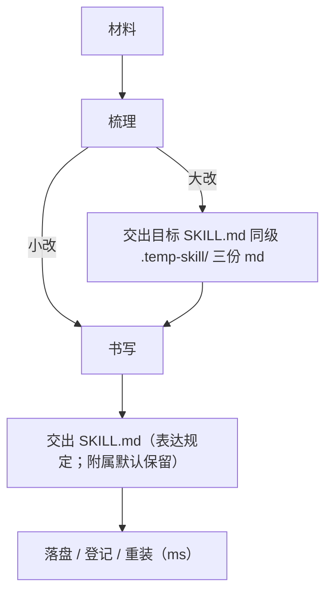

# workflow

```mermaid
flowchart TD
  material[材料] --> comb[梳理]
  comb -->|小改| write[书写]
  comb -->|大改| files["交出目标 SKILL.md 同级 .temp-skill/ 三份 md"]
  files --> write
  write --> md["交出 SKILL.md（表达规定；附属默认保留）"]
  md --> ms["落盘 / 登记 / 重装（ms）"]
```
