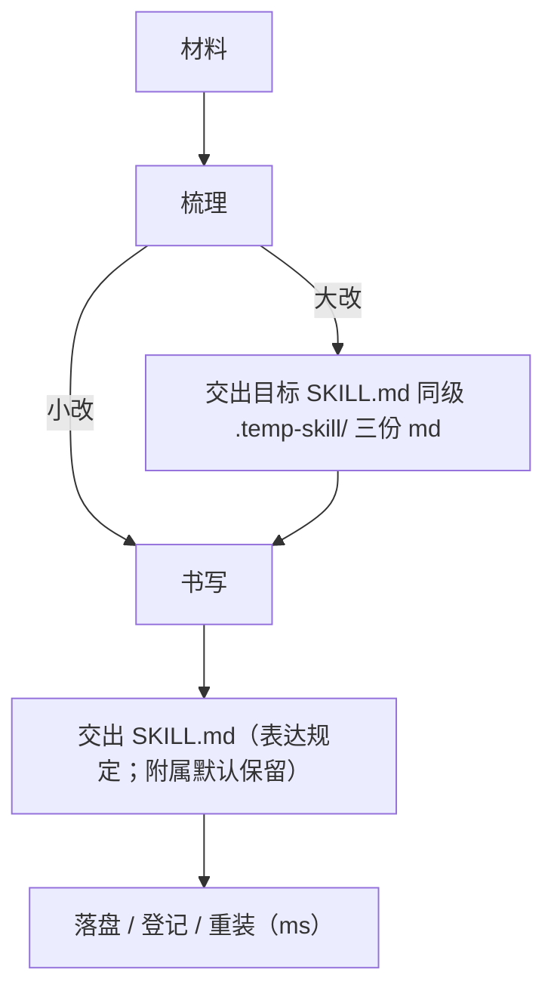

触发 ws。第一下：打开和这份 `SKILL.md` 同级的 `templates/`，判定小改还是大改。

templates 在**已安装的 write-skill 目录**（和这份 `SKILL.md` 同级），不在目标仓里找。产物写到**目标 `SKILL.md` 同级**的 `.temp-skill/`。不要把模板原文拷进去。三份 md 是梳理产物，别人执行任务时只读 `SKILL.md`。落盘、登记、重装走 manage-skills（触发词 `ms`）。

## 表达规定

流程图、目录、具体内容、重复是同一类规定。写 `SKILL.md` 和三份 md 时都遵守。不要用大段散文堆材料。允许重复，不必收归。

| 种类 | 用来表达 | 形式 |
|---|---|---|
| 流程图 | capability 谁先谁后、谁的产出给谁 | Mermaid flowchart，放 mermaid 围栏里；旁路、失败、用人分支 |
| 目录 | skill 正文骨架和落盘位置 | 正文按树展开；文件按落盘目录放 |
| 具体内容 | 二级标题下的材料，以及梳理材料里的操作 / 对照 | 分类、分点、或表格 |
| 重复 | `1.2`、`2.2`、`5.3` 等小节有同一段内容 | 每处写全文；不收归成一处；不写「同上」「见上文」 |

分类：

- 类A：xxx
- 类B：xxx

分点：

1. 第一条
2. 第二条
3. 或用 `-` `-` `-` 作并列项

表格：对照、归属、字段、路径用表，不要用一长句并列。

重复：`1.2` 和 `2.2` 都要同一段操作，就两处都写完整。不要抽成公共小节，不要改成「见 1.2」。同一条 use case 被多个 capability 用到，每个二级标题下都写全文，意思对齐。

目录分两类：

- 正文目录：capability 一级标题 `1.` `2.` `3.`；use case 二级标题 `1.1` `1.2`；capability 标题下先写它和 use case 的关系，再展开二级标题
- 落盘目录：三份 md 在目标 `SKILL.md` 同级的 `.temp-skill/`；`SKILL.md` 在 `skills/<skill-name>/`；templates 只在 write-skill 里

## 1. 梳理

判定小改还是大改是同一条链的第一下：小改停在判定，不写三份 md。大改才按顺序列出、聚合、画图；后一步只读前一步的文件。关系说明只回答为什么收在一组，顺序只留给图。

### 1.1 判定小改或大改

先定这次怎么走，再动文件。

分类：

- 小改：用户点名的局部；capability 和 use case 的目录都不增删 → 不写三份 md，去 2.1 只改对应小节
- 大改：capability 或 use case 要增删，或用户要重写整份 → 走 1.2

可观察结果：已定小改或大改。小改不要进入 1.2。

### 1.2 列出 use case

从材料里明确这份 skill 的全部基本 use case，写入目标 `SKILL.md` 同级的 `.temp-skill/use-case.md`。

分类：

- 算 use case：完成一个具体目标的一组操作，并得到可观察结果
- 不算：第几步、注意事项、还没发生的设计或一次安装预备（除非用户就是要做那件事）

操作：

1. 打开和这份 `SKILL.md` 同级的 `templates/use-case.md`
2. 遍历用户这句话、现有 `SKILL.md`、README、脚本、对话里点名的文件；改写时从现有正文和用户要改的那一段出发，不要发明两边都没有的 use case
3. 按模板写成「目标 / 操作 / 可观察结果」
4. 不要把模板本身拷进 `.temp-skill/`

可观察结果：目标 `SKILL.md` 同级的 `.temp-skill/use-case.md` 在，每条都能单独拿出来做完。没有这个文件，不要进入 1.3。

### 1.3 聚合成 capability

读目标 `SKILL.md` 同级的 `.temp-skill/use-case.md`，把 use case 收成少数 capability，写入 `.temp-skill/capability.md`。

操作：

1. 打开 `templates/capability.md`
2. 按「经常一起做、共享同一组材料」归类；通常两到五个；不要每个 use case 单独升成一个 capability
3. 每个 capability 先写关系说明：**只写为什么收在一组**，不要写谁先谁后
4. 再写一行「覆盖：」列出 `use-case.md` 里的标题
5. 同一条 use case 可以落在多个 capability；书写时每个下面都写全文，不要为了少重复去拆开或合并

可观察结果：目标 `SKILL.md` 同级的 `.temp-skill/capability.md` 在，每个 capability 都有关系说明，并能在 `use-case.md` 里找到它覆盖的那些条。没有这个文件，不要进入 1.4。

### 1.4 写出 workflow

读目标 `SKILL.md` 同级的 `.temp-skill/capability.md`，写出 capability 相互之间的流程，写入 `.temp-skill/workflow.md`。

操作：

1. 打开 `templates/workflow.md`
2. 用 Mermaid flowchart 写清谁先谁后、谁的产出给谁；图放在 mermaid 围栏里
3. 节点写 capability 名字；边上写交出的文件或门闩；旁路、失败、等人用分支画出来
4. 不要用一段话代替图，也不要把图写成步骤清单去替代 `capability.md`

可观察结果：目标 `SKILL.md` 同级的 `.temp-skill/workflow.md` 在，读完图能说出 capability 的顺序和交接。三份都在，才进入书写。

## 2. 书写

书写只把已定的范围收成 `SKILL.md`。大改按三份 md 展开树；小改只改点名小节。表达规定在这份 skill 里执行，不翻 ms。已有附属默认保留。落盘、登记、重装交给 ms。

### 2.1 写成 SKILL.md

分类：

- 大改：读目标 `SKILL.md` 同级的 `.temp-skill/` 里的三份 md，写成一份 `SKILL.md`
- 小改：不重写整棵树，只改用户点名的小节；仍遵守表达规定

正文怎么落：

- 开头先写一句触发和第一下做什么，再放 `workflow.md` 围栏里的 Mermaid 图（小改不动图，除非这次改的就是流程）
- 每个 capability 做一级标题 `1.` `2.` `3.`，标题就是 capability 的名字；标题下先写 `capability.md` 里那一段关系说明（为什么收在一组）
- 该 capability 覆盖的每个 use case 做二级标题 `1.1` `1.2`，标题就是 use case 的名字

二级标题下面的具体内容按上文「表达规定」来写：

- 分类：类A：xxx；类B：xxx
- 分点：`1.` `2.` `3.` 或 `-` `-` `-`
- 表格：对照、归属、字段、路径

做什么、看哪一个字或哪一份文件、完了是什么，写在这些结构里。命令、路径、这次输出里的字段保持字面量，不改写。不要把步骤、对照、分类写成一段话。

`1.2`、`2.2`、`5.3` 这类小节若有同一段内容：每处写全文。不收归，不写「同上」，不写「见上文」。同一条 use case 出现在多个 capability 下，每个下面都写完整的一份，意思对齐。不要把 `1.` `2.` `3.` 整章互相抄一遍；重复的是那一段动作，不是整章。

frontmatter：

- `name`：英文 kebab-case
- `description`：简体中文；写清触发词、何时用、何时不用

正文默认简体中文；只有用户明确要求其它语言时才切换。

已有附属默认保留：

- `scripts/`、参考、附录、以及不是这次 use case 的章节
- 除非用户让删，不要因为三份 md 里没有就拿掉

可观察结果：目标 skill 目录里有一份 `SKILL.md`。读完能按 `1.` `1.1` 做下去，不必再翻三份 md 才能动手。不要再写第四份 md 来代替这份 skill。
