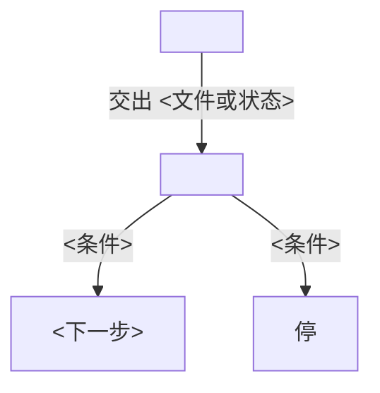

# workflow

对着这份模板写目标 `SKILL.md` 同级的 `.temp-skill/workflow.md`。不要把模板本身拷进 `.temp-skill/`。先读已经写好的 `capability.md`，再画图。

用 Mermaid flowchart 写 capability 之间谁先谁后、谁的产出给谁。不要用一段话代替图。节点写 capability 名字；边上写交出的文件或门闩。旁路、失败、等人，用分支画出来。

图放在下面这个 mermaid 围栏里。落笔时这张图是材料：合适就写进 `SKILL.md`，不要机械代填。

读完这张图，要能说出 capability 的顺序和交接。
